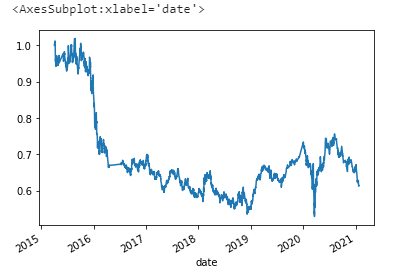
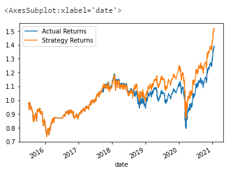
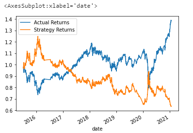

# Challenge14

# Machine Learning Trading Bot

This Jupyter notebook implements an algorithmic trading strategy that uses machine learning to automate the trade decisions. It adjust the input parameters to optimize the trading algorithm, and trains a new machine learning model and compares its performance to that of a baseline model.

---

## Technologies

This project leverages Python 3.7, scikit-learn, and tensorflow with the following packages and dependencies:

* [pandas](https://pandas.pydata.org/) - An open-source data analysis and manipulation tool

* [pathlib](https://docs.python.org/3/library/pathlib.html) - Used to identify a file using absolute or relative path

* [numpy](https://numpy.org/) - Used for numerical computing tools

* [sklearn.svm](https://scikit-learn.org/stable/modules/generated/sklearn.svm.SVC.html) - Supports Vector Classification

* [hvplot.pandas](https://hvplot.holoviz.org/user_guide/Introduction.html) - Creates modern and interactive plots and makes it easier to explore the properties of the data 

* [pandas.tseries.offsets](https://pandas.pydata.org/docs/reference/api/pandas.tseries.offsets.DateOffset.html) - Standard kind of date increment used for a date range

* [sklearn.preprocessing](https://scikit-learn.org/stable/modules/preprocessing.html) -  provides several common utility functions and transformer classes to change raw feature vectors into a representation that is more suitable for the downstream estimators

---

## Installation Guide

Python 3.7, GitBash, sklearn, pandas, and JupyterLab are required to be installed before running the application.

---

## Conclusions 

The new Decision Tree Classifier model did not perform better than the first SVM model. The SVM model has much better recall rate for class 1.0 at 0.96. The svm model plot below also shows that the cumulative actual and strategy returns are trending up and down in the same directions most of the time, whereas the dtc model plot shows the two returns almost always trend opposite directions. It's worth noting that the precision rate for both classes are not that different between the two models, but the recall rates switched positions for the two classes. In the dtc model the recall rate for class -1.0 was 0.92 instead. 

---

## Usage

To run the application simply clone the repository and run the **machine_learning_trading_bot.ipynb** with:

```python
machine_learning_trading_bot.ipynb
```

Attached screenshot below shows the report result:

  

  

  

---

## Contributors

Brought to you by Christine Guo (www.linkedin.com/in/christine-guo)

---

## License

NoNe